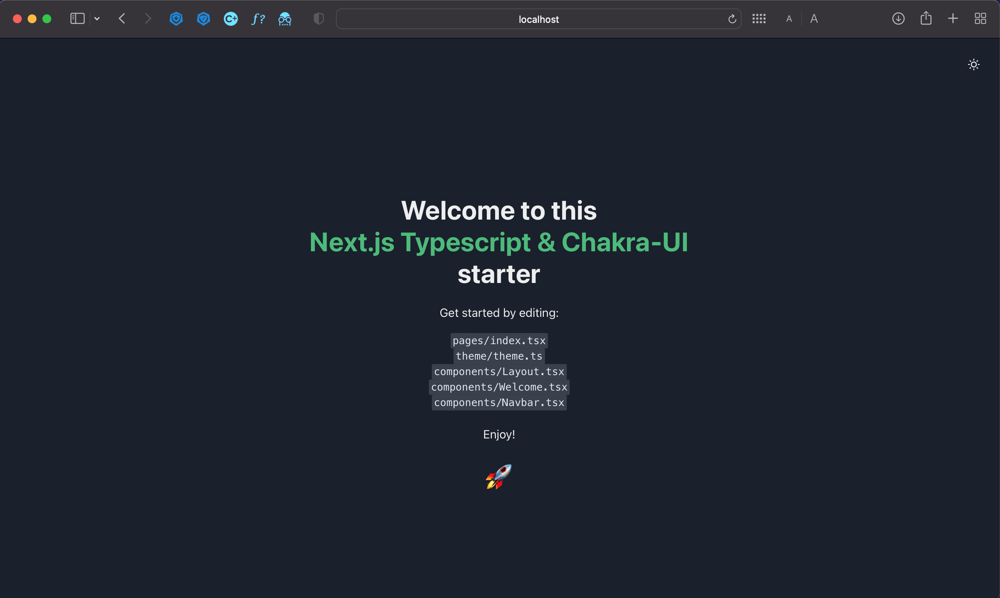

# Next.js Typescript Chakra-UI starter

[]()
[](#contributors-)

<p align="center">

</p>

## ⚡️ Quick Start

[](https://vercel.com/new/project?template=https://github.com/RickBr0wn/next-typescript-chakra-ui-starter)

## 🚀 Getting Started

These instructions will get you a copy of the project up and running on your local machine for development and testing purposes.

### Prerequisites

To get this project running locally you will need:

- a node package manager (yarn or npm)
- a command line terminal (iTerm or bash)
- your favorite IDE (vscode, sublime)

### Installing

Clone the repo, don't forget to change the name of the project:

```bash
npx create-next-app <YOUR_PROJECT_NAME> -e https://github.com/RickBr0wn/next-typescript-chakra-ui-starter
```

> Important note: If you are using npm, you will need to install the dependencies manually, by using the command `npm install` in the root of the project.

Once the project and dependencies are finished installing, you can navigate to the root directory and start up the development server with:

```bash
npm run dev
```

> Please credit this starter if you build something fantastic!

## 🧪 Running the tests

```bash
npm run test
```

This will run all of the test suites with Jest and React Testing Library, in watch mode.

## 🧐 Built With

- [Typescript](https://www.typescriptlang.org/) - TypeScript is a strongly typed programming language that builds on JavaScript, giving you better tooling at any scale.
- [React](https://reactjs.org) - A JavaScript library for building user interfaces.
- [Next.js](https://nextjs.org/) - Next.js gives you the best developer experience with all the features you need for production: hybrid static & server rendering, TypeScript support, smart bundling, route pre-fetching, and more.
- [ESLint](https://eslint.org/) - ESLint statically analyzes your code to quickly find problems.
- [Prettier](https://prettier.io/) - An opinionated code formatter.
- [Huksy](https://github.com/typicode/husky#readme) - Git hooks made easy.
- [Chakra UI](https://chakra-ui.com/) - Simple, Modular & Accessible UI Components for your React Applications.
- [Chakra UI Icons](https://github.com/chakra-ui/chakra-ui#readme) - Chakra UI's official icon library.
- [Jest](https://jestjs.io/) - Jest is a delightful JavaScript Testing Framework with a focus on simplicity.
- [React Testing Library](https://testing-library.com/docs/react-testing-library/intro/) - Simple and complete React DOM testing utilities that encourage good testing practices.
- [Jest-DOM](https://github.com/testing-library/jest-dom#readme) - Custom jest matchers to test the state of the DOM.

## ⭐️ Contributing

[CONTRIBUTING.md](https://gist.github.com/RickBr0wn/0b4a139f833e0d0bafddb0d043644b20)

## 📚 Author(s)

- **Rick Brown** - _Initial work_ - [RickBr0wn](https://github.com/RickBr0wn)

## 🪪 License

This project is licensed under the MIT License - see the [LICENSE.md](https://gist.github.com/RickBr0wn/5f95ee6118bb32034e2b94acbd88a99d) file for details.
